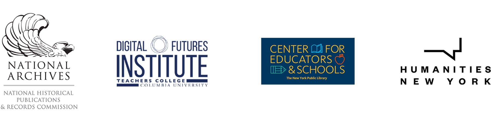

Welcome to the New York City Civil Rights History Project. As educators, scholars, activists, and students, we chose this project name because many New York City teachers and students already recognize that the civil rights movement in the US is important to teach and learn about. But students often receive only a limited, and therefore incorrect, representation of this history. We hope the name of this site is an invitation to think about something familiar in a new way.
A team of scholars, educators, activists, and advocates contributed to this project. [Find out how our work started, who has been involved, and how it developed](/project-history).

This project is housed at the [Center on History and Education at Teachers College, Columbia University]( https://www.tc.columbia.edu/che/).

The New York City Civil RIghts History Project received initial funding from the National Archives’ Public Engagement with Historical Records grant program. Additional funders and partners include:

History is always a work in progress. Interpretations of the past change as we learn more through finding new sources, and from applying new ideas and questions to the sources we have. The New York City Civil Rights Project is a work in progress in this sense and in others. There is so much yet to learn about how students of color and disabled students experienced education in New York City, and how they and those who loved them fought for justice. And there is much left to learn about how best to teach these histories.Thank you for keeping this in mind as you explore our work. We look forward to your comments, questions, and ideas. Please feel free to contact us at [nyccivilrightshistory@gmail.com](mailto:nyccivilrightshistory@gmail.com)

## Copyright

The New York City Civil Rights History Project includes reproductions of materials created by other parties. Some of the materials are in the public domain, and others are protected by copyright. Where we use materials that are under copyright, we do so either under the terms of [fair use](https://guides.library.cornell.edu/ld.php?content_id=63936868) or with the express permission of the copyright holder.

Where we reproduce materials created by other parties, we have made our best effort to secure all necessary rights. If you believe that we have made a mistake, please contact us [nycccivilrightshistory@gmail.com](mailto:nycccivilrightshistory@gmail.com) so that we can correct the oversight.

If you would like to reproduce materials created by other parties and included on this website, it is your obligation to determine and satisfy copyright or other use restrictions. You are solely responsible for determining whether the use of any digital object requires the permission of any other person or entity, and you are responsible for paying any associated fees.

All other original content, © 2023 Teachers College, Columbia University.

## Credit

If you reference material from this website, we ask that you credit the NYCCRHP and include a url to the page being referenced and date of access. For primary sources, see the  “how to cite” information under the “item details” section for each object. For reference to any other section, please cite as: “Page Title,” in New York City Civil Rights History Project, Accessed [Month Day, Year], URL.
